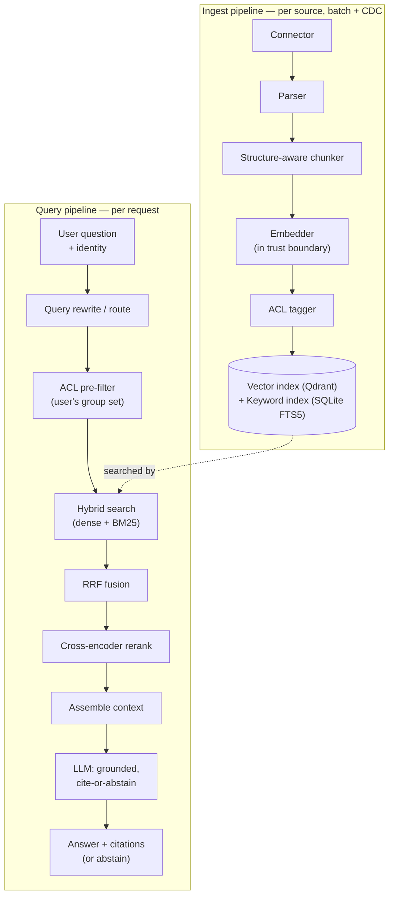
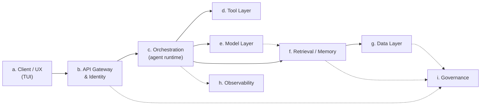

# Architecture overview

This page ties together the reference architecture spine (a–i) with the
two concrete pipelines (ingest, query) sketched in
[the original brief](context/brief.md). Every box below links to its
[low-level design](design/) and the [ADRs](decisions/) behind its shape.
Every abbreviation is defined once, centrally, in the [glossary](glossary.md).

## The two pipelines

Design detail: [ingest](design/ingest.md) · [retrieval](design/retrieval.md) ·
[model layer](design/model-layer.md). Key decisions:
[ADR-0002 ACL pre-filter](decisions/0002-acl-enforcement-at-retrieval.md) ·
[ADR-0003 hybrid + RRF](decisions/0003-hybrid-retrieval-with-rrf.md) ·
[ADR-0005 store choice](decisions/0005-vector-and-keyword-store-choice.md).

## Reference architecture spine

| Spine item | Design doc | Primary ADRs |
|---|---|---|
| a. Client / UX | [client-tui.md](design/client-tui.md) | — |
| b. API Gateway & Identity | [api-gateway-identity.md](design/api-gateway-identity.md) | [0007](decisions/0007-mock-identity-and-group-lookup.md) |
| c. Orchestration | [orchestration.md](design/orchestration.md) | [0008](decisions/0008-lightweight-orchestration.md) |
| d. Tool Layer | [orchestration.md](design/orchestration.md) (folded in) | [0008](decisions/0008-lightweight-orchestration.md) |
| e. Model Layer | [model-layer.md](design/model-layer.md) | [0004](decisions/0004-local-llm-serving-via-ollama.md), [0006](decisions/0006-embedding-model-choice.md) |
| f. Retrieval / Memory | [retrieval.md](design/retrieval.md) | [0002](decisions/0002-acl-enforcement-at-retrieval.md), [0003](decisions/0003-hybrid-retrieval-with-rrf.md), [0005](decisions/0005-vector-and-keyword-store-choice.md) |
| g. Data Layer | [data-layer.md](design/data-layer.md) | [0005](decisions/0005-vector-and-keyword-store-choice.md) |
| h. Observability | [observability.md](design/observability.md) | — |
| i. Governance | [governance.md](design/governance.md) | [0002](decisions/0002-acl-enforcement-at-retrieval.md), [0007](decisions/0007-mock-identity-and-group-lookup.md) |

## The two decisions the brief called out explicitly

1. **Access control is enforced at retrieval**, as a pre-filter inside the
   index, not as a post-hoc filter or a UI-only check —
   [ADR-0002](decisions/0002-acl-enforcement-at-retrieval.md).
2. **Retrieval quality comes from hybrid search** — dense (embeddings) plus
   keyword (Best Matching 25, BM25) — fused with Reciprocal Rank Fusion
   (RRF) —
   [ADR-0003](decisions/0003-hybrid-retrieval-with-rrf.md).

## V1 scope boundary

In scope: grounded question-answering over a few high-value sources, per-user
access control, citations, abstain-when-not-found.

Deferred (see [the brief](context/brief.md) and
[ADR-0008](decisions/0008-lightweight-orchestration.md)): write actions,
cross-source reasoning (needs a knowledge graph), agentic multi-hop
retrieval.
