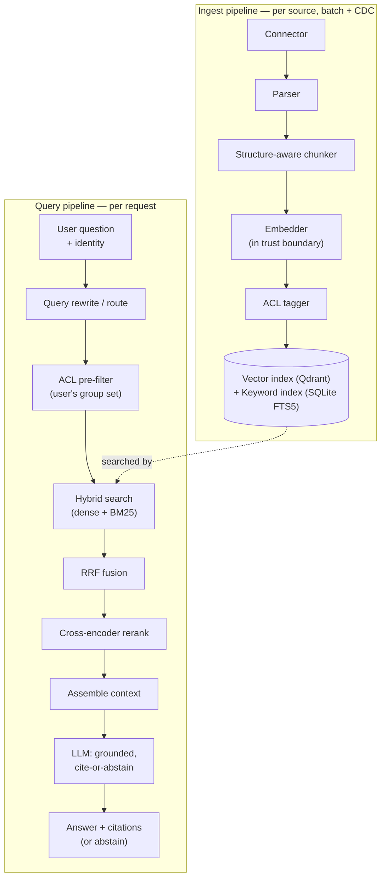
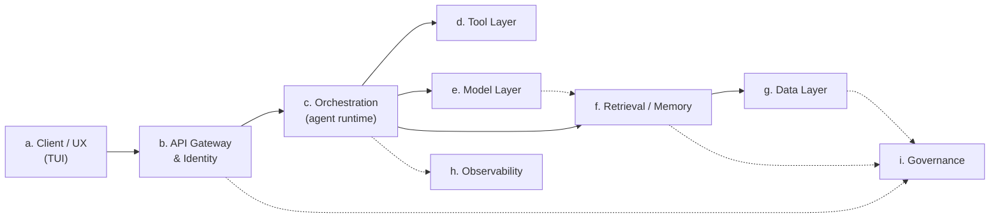
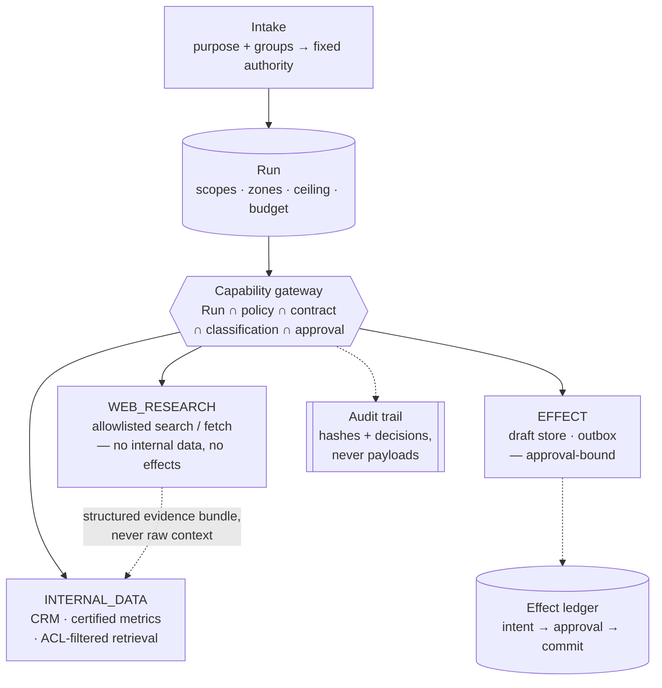

# Architecture overview

This page ties together the reference architecture spine (a–i) with the
two concrete pipelines (ingest, query) sketched in
[the original brief](context/brief.md). Every box below links to its
[low-level design](design/) and the [ADRs](decisions/) behind its shape.
Every abbreviation is defined once, centrally, in the [glossary](glossary.md).

This page is the *map*. If you would rather follow a concrete behaviour
end to end — a question being answered, a capability call being denied, an
approval being bound to a payload — [use-cases.md](use-cases.md) walks 23 of
them through the actual code, with the tests that prove each one.

## The two pipelines

Design detail: [ingest](design/ingest.md) · [retrieval](design/retrieval.md) ·
[model layer](design/model-layer.md). Key decisions:
[ADR-0002 ACL pre-filter](decisions/0002-acl-enforcement-at-retrieval.md) ·
[ADR-0003 hybrid + RRF](decisions/0003-hybrid-retrieval-with-rrf.md) ·
[ADR-0005 store choice](decisions/0005-vector-and-keyword-store-choice.md).

## Reference architecture spine

| Spine item | Design doc | Primary ADRs |
|---|---|---|
| a. Client / UX | [client-tui.md](design/client-tui.md) | — |
| b. API Gateway & Identity | [api-gateway-identity.md](design/api-gateway-identity.md) | [0007](decisions/0007-mock-identity-and-group-lookup.md) |
| c. Orchestration | [orchestration.md](design/orchestration.md) (V1 query path), [runs.md](design/runs.md) (V2 Run aggregate) | [0008](decisions/0008-lightweight-orchestration.md), [0011](decisions/0011-durable-run-aggregate.md), [0014](decisions/0014-deterministic-workflow-templates.md) |
| d. Tool Layer | [capabilities.md](design/capabilities.md) | [0012](decisions/0012-capability-registry-and-gateway.md), [0013](decisions/0013-execution-zone-isolation.md) |
| e. Model Layer | [model-layer.md](design/model-layer.md) | [0004](decisions/0004-local-llm-serving-via-ollama.md), [0006](decisions/0006-embedding-model-choice.md) |
| f. Retrieval / Memory | [retrieval.md](design/retrieval.md) | [0002](decisions/0002-acl-enforcement-at-retrieval.md), [0003](decisions/0003-hybrid-retrieval-with-rrf.md), [0005](decisions/0005-vector-and-keyword-store-choice.md) |
| g. Data Layer | [data-layer.md](design/data-layer.md) | [0005](decisions/0005-vector-and-keyword-store-choice.md) |
| h. Observability | [observability.md](design/observability.md) | — |
| i. Governance | [governance.md](design/governance.md), [policy.md](design/policy.md) | [0002](decisions/0002-acl-enforcement-at-retrieval.md), [0007](decisions/0007-mock-identity-and-group-lookup.md), [0012](decisions/0012-capability-registry-and-gateway.md) |

Item d was an empty seam in V1 ([ADR-0008](decisions/0008-lightweight-orchestration.md)
deliberately left it as a documented interface with no tools behind it).
V2 fills it — see below.

## V2: acting, not just answering

[The V2 brief](context/brief-v2.md) adds three capabilities — client
email, open-web research, structured analytics — that share a user
experience but **not a safe execution context**. Putting private data,
attacker-controllable content and an outbound channel in one context means
a single successful injection can read anything and send it anywhere.

So the organising constraint is that no execution context holds all three,
and it is enforced with **zones**:

A purpose declares which zones its Runs may reach, in
`config/policies.yaml`. `market_research` carries no `INTERNAL_DATA` and no
`EFFECT`; `client_communication` carries no `WEB_RESEARCH`. The dotted
edge between zones is the only crossing, and it carries structured claims
with sources and hashes — not free text in a model's context.

The invariant underneath all of it: **authority is carried, never
generated.** A model may choose among capabilities a Run already holds; it
cannot add a scope, recipient, destination, data class or effect class.

| V2 concern | Design doc | ADRs |
|---|---|---|
| Durable execution, budgets, state machine, workflows | [runs.md](design/runs.md) | [0011](decisions/0011-durable-run-aggregate.md), [0014](decisions/0014-deterministic-workflow-templates.md) |
| Tool contracts, registry, gateway, effects, audit | [capabilities.md](design/capabilities.md) | [0012](decisions/0012-capability-registry-and-gateway.md), [0013](decisions/0013-execution-zone-isolation.md) |
| Purposes, scopes, classification ceilings | [policy.md](design/policy.md) | [0012](decisions/0012-capability-registry-and-gateway.md) |

## The two decisions the brief called out explicitly

1. **Access control is enforced at retrieval**, as a pre-filter inside the
   index, not as a post-hoc filter or a UI-only check —
   [ADR-0002](decisions/0002-acl-enforcement-at-retrieval.md).
2. **Retrieval quality comes from hybrid search** — dense (embeddings) plus
   keyword (Best Matching 25, BM25) — fused with Reciprocal Rank Fusion
   (RRF) —
   [ADR-0003](decisions/0003-hybrid-retrieval-with-rrf.md).

## Scope boundaries

**V1** (complete): grounded question-answering over a few high-value
sources, per-user access control, citations, abstain-when-not-found.

**V2** (in progress, see [the V2 brief](context/brief-v2.md)): email
drafting with payload-bound approval, open-web research in an isolated
zone, read-only analytics over certified metrics. Write actions — deferred
in V1 — are now in scope, gated rather than absent.

Still deferred: unrestricted natural-language-to-SQL, autonomous send,
cross-source reasoning via a knowledge graph, and any single agent holding
every capability. The V2 brief's exclusion table states what would change
each of those.
